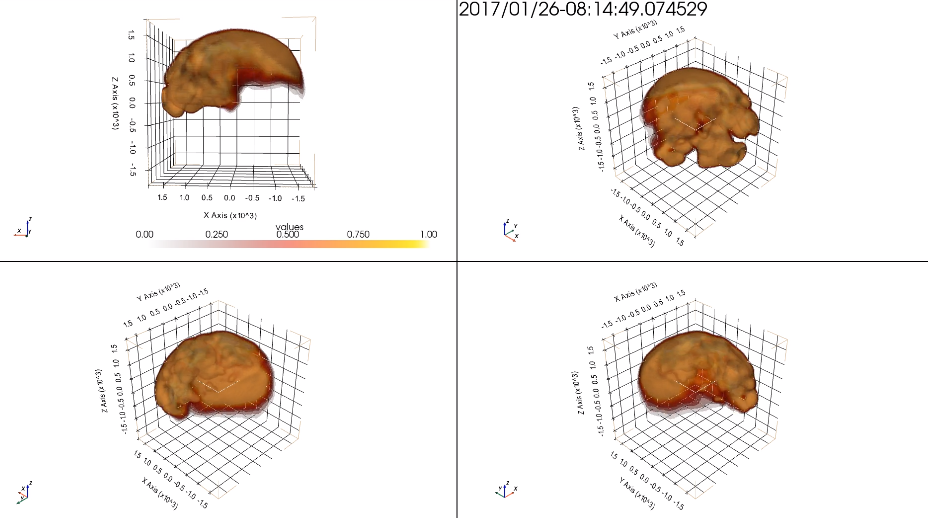

## Install Requirements

Code written in Python 3.8.2. Assume using `pip` to install dependencies, if not you're on your own. All dependencies are listed in `requirements.txt`.

1. Create a virtual environment:
```bash
pip3 install virtualenvwrapper
source virtualenvwrapper.sh
mkvirtualenv PhD-Starter-Project-env
workon PhD-Starter-Project-env
```

2. Clone repository:
```bash
git clone https://github.com/jmsplank/PhD-Starter-Project
cd PhD-Starter-Project
```

3. Install Requirements
```bash
pip install -r requirements.txt
```

4. (Optional) Modify pyspedas download directory
```bash
cd ~/.virtualenvs/PhD-Starter-Porject-env/lib/python3.8/site-packages/pyspedas/mms/
vi mms_config.py
```
And modify the `local_data_dir` parameter (Note: Use full path as ~ <HOME> etc. may not work)

## Running the code

Most scripts are self contained. Use `python <PATH_TO_SCRIPT>` to run the script. E.g. `python shock_normal/timing_analysis.py`

## Generating animations

Animations can be generated from the command line tool in `src/distribution_function/animate_velocity.py`. At minimum, a start time and end time must be supplied. Other options are output filename (`-o`), date (`-d`) and probe (`-p`).

There are some pre-generated animations in `/animations`.



### Examples

To look at the period from 08:14:04 to 08:16:30 on 26th Jan 2017, using the `date` keyword:

`python animate_velocity.py 08:14:04 08:16:30 -d 2017-01-26`

To look at the same period without using `date`, simply:

`python animate_velocity.py 2017-01-26/8:14:04 2017-01-26/08:16:30`

To specify a specific output filename:

`python animate_velocity.py 2017-01-26/8:14:04 2017-01-26/08:16:30 -o animation.mp4`

Note that if the filename supplied does not end in `.mp4` then that will automatically be appended. It is not currently possible to write to a different filetype. `vlc` can transcode if necessary.

To change the probe from default (4):

`python animate_velocity.py 2017-01-26/8:14:04 2017-01-26/08:16:30 -p 1`

Will change to probe 1, options are `1,2,3,4`.
